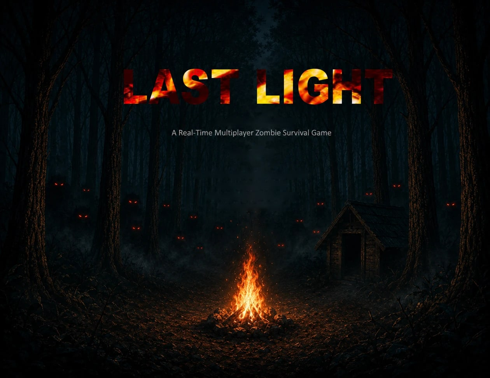
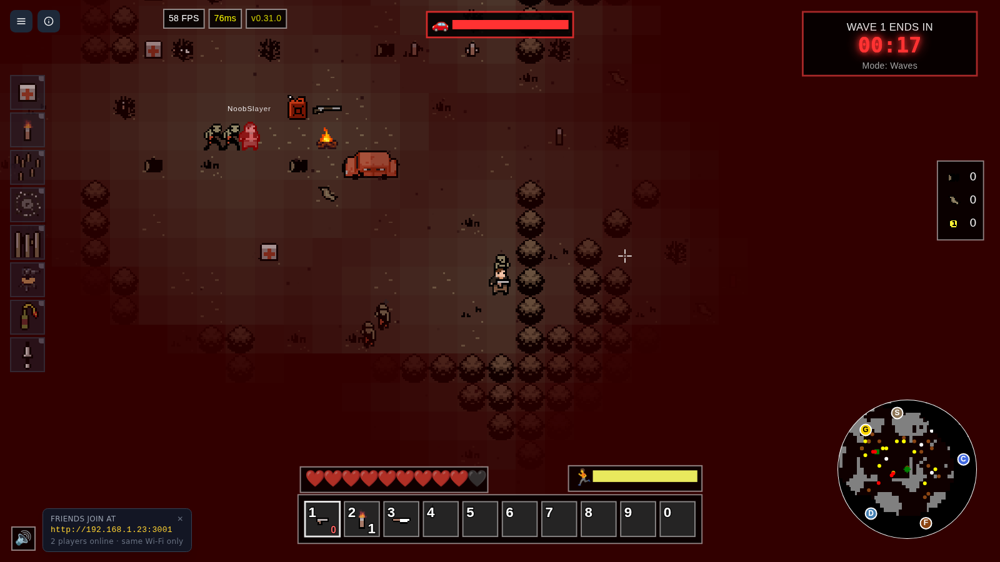
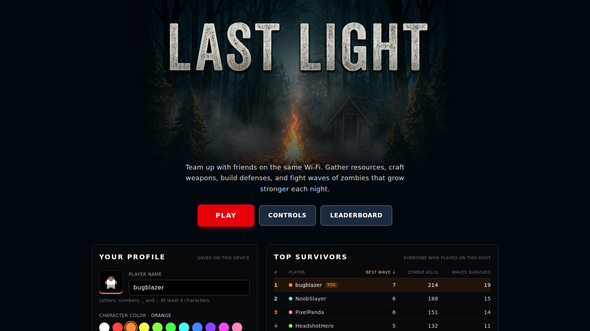
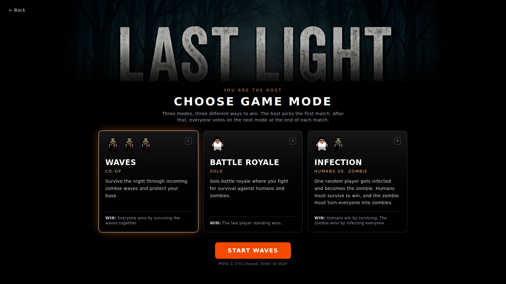
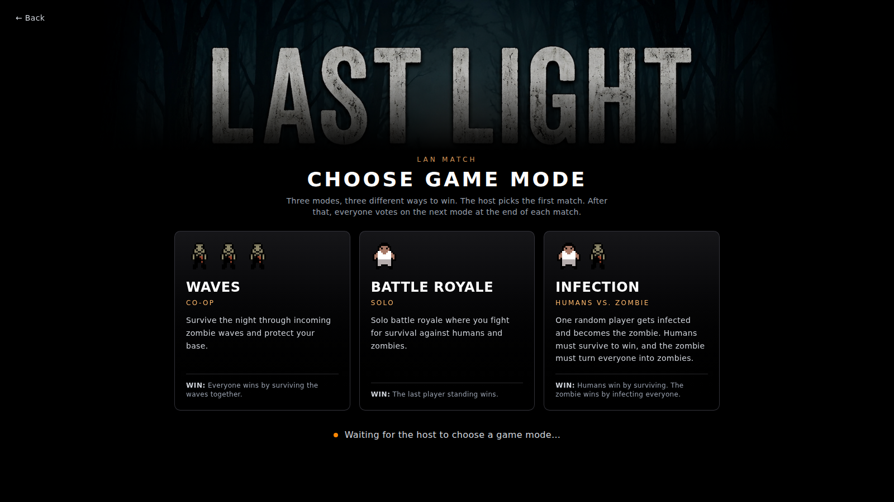
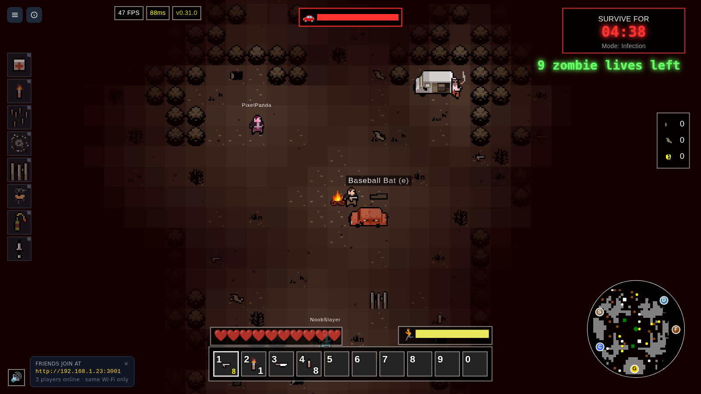

# Last Light



A top-down pixel-art survival game for friends. During the day you explore for wood, cloth, gasoline
and coins, craft walls, spike traps, sentry guns and torches, and fortify a camp. At night the zombies
come, and every night there are more of them.



## Play it on your Wi-Fi (LAN edition)

**Download:** [Last Light LAN v1.0 for Windows](https://github.com/bugblazer/last_light/releases/tag/lan-v1.0)

The LAN edition needs no internet, no accounts and no installs for anyone except the host:

1. One person on Windows downloads the zip, unzips it and double-clicks `LastLight.exe`.
2. The console window shows the address to join, for example `http://192.168.1.20:3001`. It's also
   shown in a "Friends join at" box in the corner of the game.
3. Everyone else on the same Wi-Fi opens that address in their browser.
4. The host picks the first game mode; after that, everyone votes between matches.

Windows may warn that the app is from an unknown publisher, because the exe isn't code-signed yet.
Choose "More info", then "Run anyway". Allow it through the firewall when asked, or friends can't
connect.

### Game modes

- **Waves:** co-op. Everyone defends the camp together.
- **Battle Royale:** every player for themselves, against each other and the zombies.
- **Infection:** one random player becomes a zombie, and everyone they catch joins their side.

### How the LAN edition is built

- **One file.** `LastLight.exe` is a Node.js single executable application with the game server, the
  browser client, every sprite and every sound embedded, so the host doesn't need Node installed.
- **No native dependencies.** The online server's uWebSockets.js layer is replaced by an adapter on
  the pure-JavaScript `ws` package that speaks the same wire protocol, so the browser client works
  unchanged. The game and its files are served on one port.
- **A leaderboard without a database.** Kills and waves survived are saved to a JSON file in
  `%APPDATA%\LastLight`. Each browser keeps a local profile (a name and a colour).
- **Fair play.** Admin chat commands are locked behind a random password unless the host sets one, so
  nobody can cheat onto the leaderboard.

| The home screen and local leaderboard | The host choosing the first mode |
| --- | --- |
|  |  |
| **A guest waiting for the host** | **Infection mode** |
|  |  |

### Build it yourself

The LAN edition's source is in [`packages/lan`](packages/lan), with a full description of each piece
in its [README](packages/lan/README.md). From the repo root:

```bash
npm install
npm run lan:dev           # build and run the LAN server with Node (http://localhost:3001)
npm run lan:package:win   # build packages/lan/release/LastLight.exe
```

LAN edition by [bugblazer](https://bugblazer.dev). Art credits are in [CREDITS.md](CREDITS.md).

## Developing the game

The rest of this file covers running and extending the full (online) version from source: a
TypeScript monorepo with a Node.js game server, a Canvas 2D browser client, a shared package used by
both, and a website for accounts, the lobby and stats.

### How to Run

1. `npm i`
2. `cp packages/website/.env.example packages/website/.env`
3. `npm run dev`

### Deployment

The game can be deployed to any VPS easily by following these steps:

1. Get a VPS
2. Install docker on your VPS
3. Clone this repository to your VPS
4. Configure your domain in the `Caddyfile` (if you plan to use a domain)
5. Build and start the containers:
   ```bash
   docker-compose up -d --build
   ```

This will start:

- The website on port 3000
- The game-server on port 3001
- Caddy reverse proxy handling HTTPS on ports 80/443

To stop the deployment:

```bash
docker-compose down
```

### Contributing

#### How to Add a New Entity

see Spike.ts for a good example of a server entity using ECS.

1. Create an entity class and put it somewhere intelligent in the game-server/src/shared/entities directory
2. Add the entity to the `EntityFactory` in the `client` package.

#### How to Add a New Extension

Extensions are a core part of our Entity Component System (ECS) that add specific behaviors to entities. Here's how to create one:

1. Create an extension class in the `game-server/src/shared/extensions` directory
2. Add the extension to the `extensionsMap` in `game-server/src/shared/extensions/index.ts` file

##### Example: Creating a Combustible Extension

Here's an example of how to create an extension that makes entities burst into flames when destroyed:

```typescript
import { Extension, ExtensionNames, ExtensionSerialized } from "./types";
import { Positionable } from "./index";
import { Entity } from "../entities";
import { EntityType } from "../entity-types";

export default class Combustible implements Extension {
  // Define a unique name for the extension
  public static readonly Name = ExtensionNames.combustible;

  // required
  private self: Entity;

  // only used on this example
  private entityFactory: EntityFactory;

  // SERIALIZED PROPERTIES
  private numFires: number;
  private spreadRadius: number;

  // Constructor receives the entity this extension is attached to
  public constructor(
    self: Entity,
    entityFactory: EntityFactory,
    numFires = 3,
    spreadRadius = 32
  ) {
    this.self = self;
    this.entityFactory = entityFactory;
    this.numFires = numFires;
    this.spreadRadius = spreadRadius;
  }

  public update() {
    // if an extension has an update method, it'll be invoked each server tick
  }

  public deserialize(data: ExtensionSerialized): this {
    // this is invoked client side; if you have properties you want to sync between clients and server, you can deserialize them here
    return this;
  }

  public serialize(): ExtensionSerialized {
    // this is invoked server side; if you have properties you want to sync between clients and server, you can serialize them here
    return {
      type: Combustible.type,
      numFires: this.numFires,
      spreadRadius: this.spreadRadius,
    };
  }
}
```

To use this extension on an entity:

```typescript
// In your entity class
import Combustible from "../extensions/combustible";

class ExplodingZombie extends Entity {
  constructor() {
    super();
    this.addExtension(new Combustible(this, entityFactory));
  }
}
```

Final Setup

1. Add the extension to `extensionsMap` in `game-server/src/shared/extensions/index.ts`
2. Add the extension to `ExtensionNames` in `game-server/src/shared/extensions/types.ts`

Key points when creating extensions:

- Implement `serialize` and `deserialize` methods for network synchronization
- Extensions can interact with other extensions through the parent entity

### Admin Commands

1. set the password in the browser console `commandManager.setAdminPassword('default-admin-password');`
2. send a command `commandManager.createItem('pistol')`
